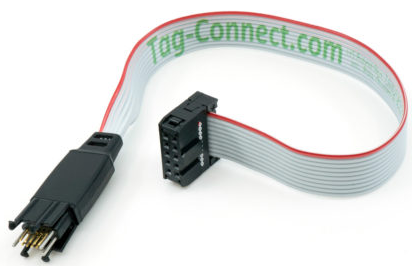
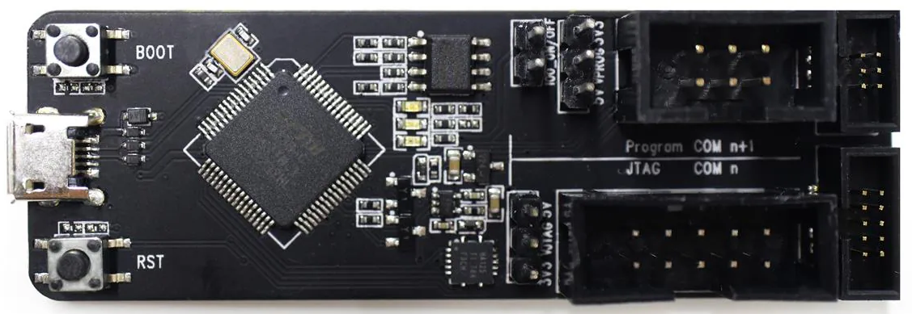
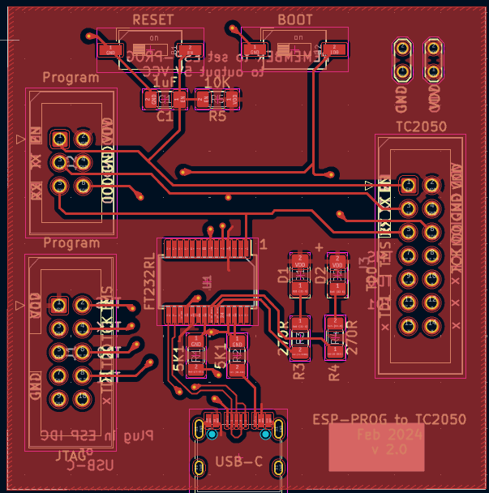
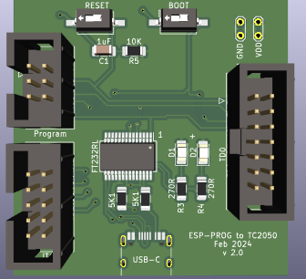
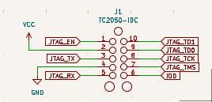
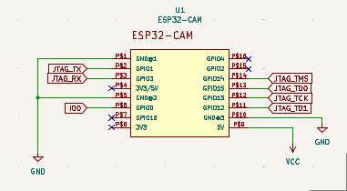

# Project14-ESP-PROG-Connector

Helper board to allow connecting to ESP32 boards easier - i.e. from PlatformIO I can connect via the USB-C to access this helper boards FTDI chip to then connect onwards to whatever ESP32 I am developing at the time

It allows a Tag Connect cable (TDC2050) to connect to the ESP32 board 

As the connector is 10 pins I could include the power + TX/RX + Boot/Reset also the pins needed for hardware debugging on the same connector. I googled to see if I could find standardised pins for this sort of thing but didnt have any luck, so just made my own.

OR

The board allows the same TDC2050 to be used - but along with an ESP32 debugging board

(Only issue I have with the ESP32-Prog board is that it uses a micro-usb connector rather than a USB-C so I would expect that to really limit what power it can supply to my ESP32 board.)

## Simple screenshot of the PCB

## Simple Kicad 3D representation of the board

## Schematic of TDC 2050 connector on my ESP32 board

This is the schematic of the connector to put on the destination ESP32 board 

Example of connecting this to an ESP32-CAM for both USB monitoring and hardware debugging

## View of the project

I am used to having RX + TX pins on my ESP32 boards or a USB-C connector - but with this project I can just add in the TDC-2050 pinout and then when I want to debug the board it is a simple connection to my PC. I can even hardware debug using the same connector.